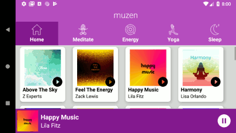

# Muzen
Muzen App. Still in production...

  

Landscape:

Musical Structure for Udacity Android Basics, Nanodegree 

My inspiration came from Google Play Music, of course.

Some of the backgrounds used for Album Art were obtained from the site http://freepik.com
	The Play/Pause/Skip icons are from http://material.io/icons
	The category icons were obtained from http://flaticon.com
  Song and Artist Names are fictional, any likeness to actual artists is coincidental.
  
  
